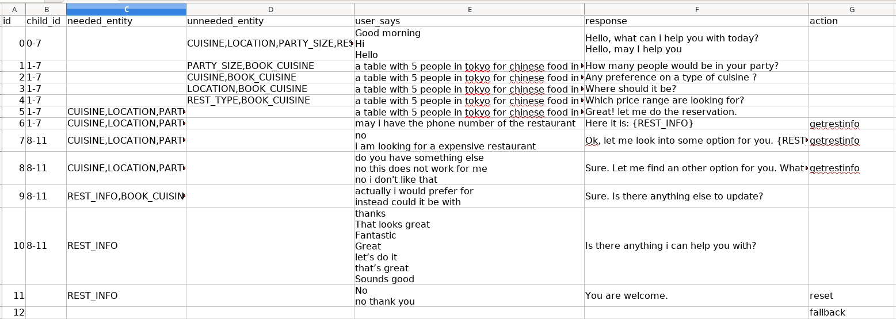
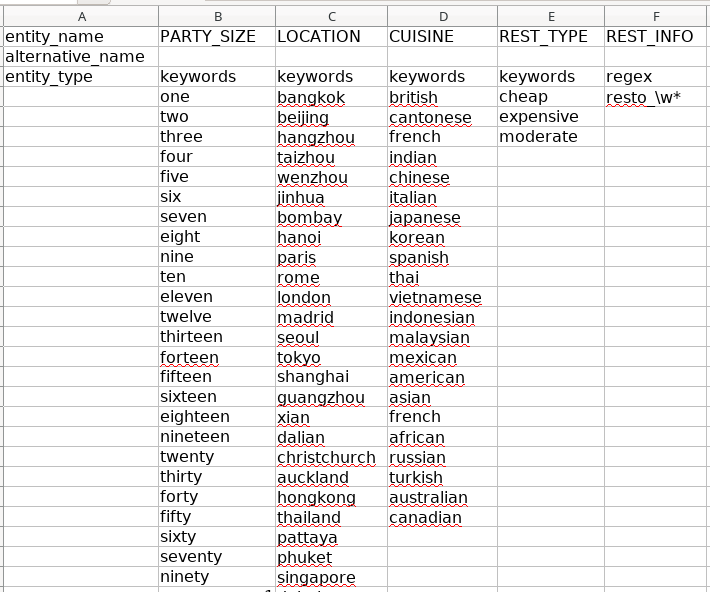

# Get started to rule-based chatbot 
## About concept of rule-based chatbot
By pre-defining a list of potential response, related user-says,  and limitation of search scope, the rule-based chatbot will try to search the most closed predefined user-says, extract the entities from query, and then call the function and return the correlated response. 
For each session, a global dialog status is used to save some global variables, for example, the dialog history, the entities, etc. For rule-based chatbot, only the variable 'entities' is used. It is a python dictionary to save entities extracted from query in each loop and values extracted from hook functions. This variable is used to fill the response template to get the final response.
## About the rules
The rules is editable in an excel file. It has two spreadsheets named:

- **dialogs**
	Define the dialog flows
- **entities**
	Define the needed entities
	
Let's discuss about how to define a chatbot using these two spreadsheets:
#### dialogs
An example dialog flow rule is like:
 
The first row is the column names
The following rows are intents, each row is a predefined intent, which include:

 - **id**: Unique intent id, int
 - **user_says**: The potential user says. The chatbot will calculate similarities between query and all user says in search range to search the intent. Please define all potential user says split by line break in one cell to improve the performance of search.  The empty user_says  will be used to generate fallback response, and will only be used in some special scenarios. 
 - **response**: Response template. If several responses defined with line break split, will randomly choose one. Note "{ENTITY_NAME}" in  response template will be replaced by correlated entity value for final response.
 - **hook**: Hook function names to call. The input is the entity dictionary, and the output is also a dictionary and will be merged to entity dictionary. If your returned dictionary contains "RESPONSE", the value of it will replace your predefined response and be used for final response. 
 
 The followings are used to limit the search scope of intent. Empty cell means no limitation.
 
 - **child_id**: Limit the searchable id range for next dialog loop, splitted by "**,**", and support range symbol "**-**". 
 - **needed_entity**: Entity name list, means the intent is searchable **only** when related entities exists in global dialog status.
 - **unneeded_entity**: Entity name list, means the intent is **not** searchable when related entities exists in global dialog status.

#### entities
An example of predefined entities
 
This table defines the needed entities. From the second column, each column defines an entity, with correlated entity_name, alternative_name, entity_type, and potential values.
The first row defines the entity name
The second defines the alternative name which will be used to replace the origin entity name
The third row defines the method to get the entity. Currently it support three methods:

- **keywords**: Means entity extracted from keyword matching. The following rows in this column defined potential keywords for this entity, one per cell.
- **regex**: Means entity extracted from regular expression. The following rows in this column is used to define the regular expression
- **ner**: Means entity extracted from NER model. Currently we use spacy to extract entities.

## Some examples
- If no limitations in child_id, needed_entity, unneeded_entity, the chatbot can be used as a simple question and answer engine. 
- If limitations and hook functions are defined, then it is a rule-based goal-oriented chatbot.

